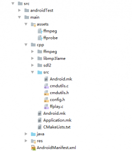

### 一、FFmpeg编译

1、下载源码  [https://github.com/FFmpeg/FFmpeg](https://github.com/FFmpeg/FFmpeg)

2、编译环境 ubuntu16.04 64位

3.1、编译脚本  arm64.sh

!/bin/bash
NDK=/home/shixq/android-ndk-r14b
SYSROOT=$NDK/platforms/android-21/arch-arm64
TOOLCHAIN=$NDK/toolchains/aarch64-linux-android-4.9/prebuilt/linux-x86_64

CPU=arm64-v8a
PREFIX=$(pwd)/android/$CPU
MP3LAME=/home/shixq/android-projects/ffmpeg/libmp3lame
ARCH=aarch64

./configure \
--prefix=$PREFIX \
--enable-cross-compile \
--cross-prefix=$TOOLCHAIN/bin/aarch64-linux-android- \
--target-os=linux \
--arch=$ARCH \
--sysroot=$SYSROOT \
--extra-cflags="-fPIE -pie -I$SYSROOT/usr/include -I$MP3LAME/include -march=armv8-a" \
--extra-ldflags="-fPIE -pie -L$SYSROOT/usr/lib -L$MP3LAME/lib/$CPU" \
--disable-shared \
--enable-static \
--disable-doc \
--disable-ffplay \
--disable-decoders \
--disable-encoders \
--enable-libmp3lame \
--enable-encoder=libmp3lame \
--enable-decoder=flv \
--enable-decoder=mpeg4 \
--enable-decoder=h264 \
--enable-decoder=hevc \
--enable-decoder=yuv4 \
--enable-decoder=mp3 \
--enable-decoder=aac \
--enable-decoder=png \
--enable-decoder=mjpeg

make clean
make
make install

3.2、编译脚本arm.sh

!/bin/bash
NDK=/home/shixq/android-ndk-r14b
SYSROOT=$NDK/platforms/android-21/arch-arm
TOOLCHAIN=$NDK/toolchains/arm-linux-androideabi-4.9/prebuilt/linux-x86_64

CPU=armeabi-v7a
PREFIX=$(pwd)/android/$CPU
MP3LAME=/home/shixq/android-projects/ffmpeg/libmp3lame
ARCH=arm

./configure \
--prefix=$PREFIX \
--enable-cross-compile \
--cross-prefix=$TOOLCHAIN/bin/arm-linux-androideabi- \
--target-os=linux \
--arch=$ARCH \
--sysroot=$SYSROOT \
--extra-cflags="-fPIE -pie -I$SYSROOT/usr/include -I$MP3LAME/include -march=armv7-a" \
--extra-ldflags="-fPIE -pie -L$SYSROOT/usr/lib -L$MP3LAME/lib/$CPU" \
--disable-shared \
--enable-static \
--disable-doc \
--disable-ffplay \
--disable-decoders \
--disable-encoders \
--enable-libmp3lame \
--enable-encoder=libmp3lame \
--enable-decoder=flv \
--enable-decoder=mpeg4 \
--enable-decoder=h264 \
--enable-decoder=hevc \
--enable-decoder=yuv4 \
--enable-decoder=mp3 \
--enable-decoder=aac \
--enable-decoder=png \
--enable-decoder=mjpeg

make clean
make
make install

3、将上边的编译脚本放到ffmpeg根目录执行，生成静态库文件和可执行文件。如果用ndk-r14b编译可能会遇到B0宏定义问题，解决办法修改ffmpeg源码中B0为其他变量（例如b0）。

### 二、SDL

1、下载最新源码2.0.8。

2、Android Studio新建工程

将sdl根目录下的src文件夹放到sdl2中，可执行文件放到assets中

3、如何使用ffmpeg与sdl
移植ffmpeg官方示例ffplay，修改ffplay.c中realloc_texture方法
<pre>static int realloc_texture(SDL_Texture **texture, Uint32 new_format, int new_width, int new_height,
                           SDL_BlendMode blendmode, int init_texture) {
    Uint32 format;
    int access, w, h;
    if (!*texture || SDL_QueryTexture(*texture, &amp;format, &amp;access, &amp;w, &amp;h) &lt; 0 || new_width != w ||
        new_height != h || new_format != format) {
        void *pixels;
        int pitch;
        if (*texture) {
            SDL_DestroyTexture(*texture);
        }
        if (!(*texture = SDL_CreateTexture(renderer, new_format, SDL_TEXTUREACCESS_STREAMING,
                                           new_width, new_height)))
            return -1;
        if (SDL_SetTextureBlendMode(*texture, blendmode) &lt; 0)
            return -1;
        if (init_texture) {
            if (SDL_LockTexture(*texture, NULL, &amp;pixels, &amp;pitch) &lt; 0)
                return -1;
            memset(pixels, 0, pitch * new_height);
            SDL_UnlockTexture(*texture);
        }
        av_log(NULL, AV_LOG_VERBOSE, "Created %dx%d texture with %s.\n", new_width, new_height,
               SDL_GetPixelFormatName(new_format));
    }
    return 0;
}</pre>

修改video_open方法
<pre>
static int video_open(VideoState *is) {
    int w, h;
    SDL_GetWindowSize(window, &amp;screen_width, &amp;screen_height);
    if (screen_width) {
        w = screen_width;
        h = screen_height;
    } else {
        w = default_width;
        h = default_height;
    }
    &nbsp;
    if (!window_title)
        window_title = input_filename;
    SDL_SetWindowTitle(window, window_title);
    SDL_SetWindowSize(window, w, h);
    SDL_SetWindowPosition(window, SDL_WINDOWPOS_CENTERED, SDL_WINDOWPOS_CENTERED);
    &nbsp;
    if (is_full_screen)
        SDL_SetWindowFullscreen(window, SDL_WINDOW_FULLSCREEN_DESKTOP);
    SDL_ShowWindow(window);
    is-&gt;width = w;
    is-&gt;height = h;
    return 0;
}
</pre>
枚举类型ShowMode移到VideoState外边

### 三、demo地址
[https://github.com/shixueqiang/ffplay-android](https://github.com/shixueqiang/ffplay-android)